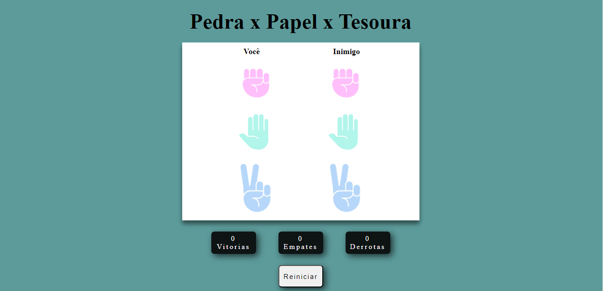

<h1 align="center">Jogo ✊ 🆚 ✋ 🆚 ✌️</h1>

Este repositório contém a implementação de uma página web interatica que oferece aos usuários a oportuniadde de jogar o clássico jogo "Pedra, Papel ou Tesoura". Este projeto faz parte do curso de JavaScript Completo ministrado pela <a href="https://cursos.dankicode.com/">Daki Code</a>, visando aprofundar as hanilidades em programação front-end.

  <a href="#🚀-tecnologias">Tecnologias</a>&nbsp;&nbsp;&nbsp;|&nbsp;&nbsp;&nbsp;
  <a href="#💻-projeto">Projeto</a>&nbsp;&nbsp;&nbsp;|&nbsp;&nbsp;&nbsp;
  <a href="#🔖-layout">Layout</a>&nbsp;&nbsp;&nbsp;|&nbsp;&nbsp;&nbsp;

## 🚀 Tecnologias

Esse projeto foi desenvolvido com as seguintes tecnologias:

- HTML e CSS
- JavaScript
- Git e Github

## 💻 Projeto

O jogo "Pedra, Papel ou Tesoura" é uma recriação digital do jogo de mão clássico, no qual os jogadores escolhem entre três opções (pedra, papel ou tesoura) e o vencedor é determinado pelas regras tradicionais do jogo.

- [Acesse o projeto finalizado, online](https://jp-xaxa.github.io/pedra-papel-tesoura/)

<h1 align="center">
  Funcionalidades
</h1>

A implementação abrange uma interface de usuário de design simples e amigável. Além disso, a aplicação inclui a funcionalidade de contabilizar as vitórias, derrotas e empates do usuário, juntamente com um botão dedicado para redefinir essas estatísticas.

## 🔖 Layout

  

